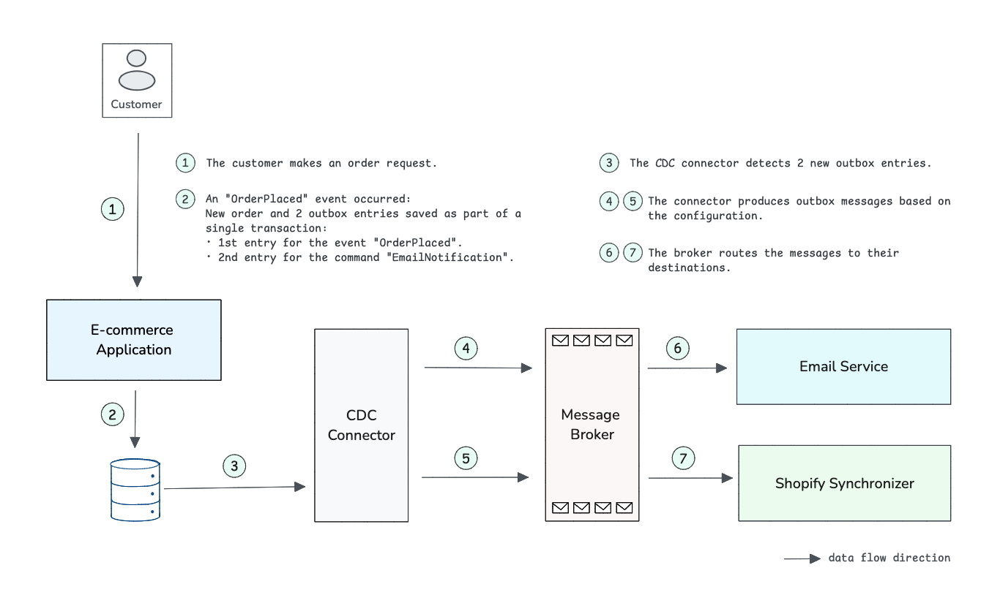

= Spring Outbox

Spring Outbox is an implementation of the transactional outbox pattern that helps Spring developers implement an efficient event-driven architecture for microservices and monolithic applications.

== Implementation Key Considerations

- When a domain event occurs, it generates one or more messages.
- Each outbox entry represents either an event or a command.
- An operation, part of an event, represents the action performed on the root entity (e.g., create, update, award) and helps consumers determine if deserialization is needed.
- Decouple the outbox message producer and consumer to enable scalability and independent evolution.
- Keep the Debezium connector simple by focusing on reading outbox entries and producing messages.

== Spring Outbox in Action

Let's consider the following business requirement:

When a customer places an order, the system should:

1. Record the order details, marking it as paid.
2. Notify the customer via email with an order confirmation.
3. Synchronize the order with Shopify to keep the store updated.

Here’s an overview of the architecture for this requirement:

Following are the steps to implement this design with Spring Outbox:

NOTE: Spring Outbox supports multiple databases and brokers.
In this example, we use MySQL and RabbitMQ.

. *Add dependencies* +
Include the following dependency in your E-commerce Spring Boot application along with necessary Spring starters such as `spring-boot-starter-data-jpa` and `spring-boot-starter-web`:
+
[source,xml]
----

<dependency>
    <groupId>io.github.raedbh</groupId>
    <artifactId>spring-outbox-jpa</artifactId>
    <version>0.2.0</version>
</dependency>
----

. *Enable Spring Outbox for JPA* +
Annotate the main application class with `@EnableJpaRepositories`, specifying `OutboxJpaRepositoryFactoryBean` as the `repositoryFactoryBeanClass`:
+
[source,java]
----
@SpringBootApplication
@EnableJpaRepositories(repositoryFactoryBeanClass = OutboxJpaRepositoryFactoryBean.class)
public class EcommerceApplication {

    public static void main(String[] args) {
        SpringApplication.run(EcommerceApplication.class, args);
    }
}
----

. *Configure automatic outbox table creation* +
Set the following property in your `application.properties` (or `application.yml`) file to automatically create the outbox table on application startup:
+
[source,properties]
----
spring.outbox.rdbms.auto-create=true
----

. *Define the Root Entity*
+
[source,java]
----
@Entity
@Table(name = "orders")
public class Order extends RootEntity {

    private @Id UUID id;
    private BigDecimal totalAmount;
    // Other fields

    @Override
    public UUID getId() {
        return id;
    }

    // Other getters / setters
}
----

. *Define the Event*
+
[source,java]
----
class OrderPlaced extends EventOutboxed<Order> {

    protected OrderPlaced(Order source, CommandOutboxed cmd) {
        super(source, cmd);
    }

    @Override
    public String getOperation() {
        return "payment";
    }
}
----

. *Define the Command*
+
[source,java]
----
public class EmailNotification implements CommandOutboxed {

    private String to;
    private String subject;
    private String body;
    // ...
}
----

. *Implement the order payment logic*
+
[source,java]
----
@Entity
@Table(name = "orders")
public class Order extends RootEntity {

    private @Id UUID id;
    private BigDecimal totalAmount;
    // Other fields

    Order markPaid(EmailNotification withNotification) {

        // Business logic here

        // Assign the event, which will be triggered later
        assignEvent(new OrderPlaced(this, withNotification));

        return this;
    }

    @Override
    public UUID getId() {
        return id;
    }

    // Other getters / setters
}

----

. *Implement the application service*
+
[source,java]
----
@Service
public class OrderManagement {

    private final OrderRepository repository;

    OrderManagement(OrderRepository repository){
        this.repository = repository;
    }

    @Transactional
    Order placeOrder(Order order, EmailNotification emailNotification) {

        order.markPaid(emailNotification);

        return repository.save(order);
    }
}
----
When the `placeOrder` method is called, Spring Outbox triggers the assigned event, producing new entries (for event and command) in the outbox table.

. *Run the Debezium connector* +
The debezium connector detects new entries in outbox table and transmits them to RabbitMQ.
Follow these steps to set it up:
- Download the connector from Maven Central: https://repo1.maven.org/maven2/io/github/raedbh/spring-outbox-debezium-connector-mysql-rabbit/0.2.0/spring-outbox-debezium-connector-mysql-rabbit-0.2.0.jar[spring-outbox-debezium-connector-mysql-rabbit-0.2.0.jar]
- Create the queues `shopify.orders` and `emails` in RabbitMQ.
- Replace the property values with your specific configurations then execute the following command to run the connector:
+
[source,shell]
----
java -jar spring-outbox-debezium-connector-mysql-rabbit-0.2.0.jar \
    --spring.outbox.connector.database.hostname=<db_host> \
    --spring.outbox.connector.database.dbname=<db> \
    --spring.outbox.connector.database.user=<db_user> \
    --spring.outbox.connector.database.password=<db_password> \
    --spring.outbox.connector.offset-storage.filepath=<outbox_offset_storage_file> \
    --spring.outbox.connector.schema-history.filepath=<outbox_schema_history_file> \
    --spring.outbox.connector.rabbit.messages.order-placed.routing-key=shopify.orders \
    --spring.outbox.connector.rabbit.messages.email-notification.routing-key=emails \
    --spring.rabbitmq.host=<rabbit_host> \
    --spring.rabbitmq.username=<rabbit_user> \
    --spring.rabbitmq.password=<rabbit_password>
----
+
NOTE: `<db_user>` requires at least one of the `SUPER` or `REPLICATION CLIENT` privileges to allow the connector to read from the MySQL binary log.
+
After successful execution, you should see logs similar to the following, with a new message added to each queue (`shopify.orders` and `emails`):
+
[source,shell]
----
 INFO 5095 --- [ebeziumConsumer] i.g.r.s.o.c.c.DebeziumRabbitRouteBuilder : Change processing [operation: c] [body: Struct{id=java.nio.HeapByteBuffer[pos=0 lim=16 cap=16],type=OrderPlaced,payload=java.nio.HeapByteBuffer[pos=0 lim=532 cap=532],metadata={"operation":"payment","event_entity_id":"c59d04ee-c872-4ad2-868e-2dc921ef7bd0","event_entity_type":"Order","event_occurred_at":"1735010989279"}}]
 WARN 5095 --- [ebeziumConsumer] .g.r.s.o.c.r.RabbitOutboxMessageProducer : No exchange found for OrderPlaced
 INFO 5095 --- [ebeziumConsumer] .g.r.s.o.c.r.RabbitOutboxMessageProducer : Message sent to exchange 'null' with routing key 'shopify.orders'.
 INFO 5095 --- [ebeziumConsumer] i.g.r.s.o.c.c.DebeziumRabbitRouteBuilder : Change processing [operation: c] [body: Struct{id=java.nio.HeapByteBuffer[pos=0 lim=16 cap=16],type=EmailNotification,payload=java.nio.HeapByteBuffer[pos=0 lim=132 cap=132]}]
 WARN 5095 --- [ebeziumConsumer] .g.r.s.o.c.r.RabbitOutboxMessageProducer : No exchange found for EmailNotification
 INFO 5095 --- [ebeziumConsumer] .g.r.s.o.c.r.RabbitOutboxMessageProducer : Message sent to exchange 'null' with routing key 'emails'.
----
. *Consume Outbox messages* +
Once messages are successfully delivered to the broker, they can be consumed by the Email Service and Shopify Synchronizer.
Here's how to set this up:
- Add the following dependency to the Email Service and Shopify Synchronizer Spring Boot applications along with necessary Spring starters such as `spring-boot-starter-amqp`:
+
[source,xml]
----

<dependency>
    <groupId>io.github.raedbh</groupId>
    <artifactId>spring-outbox-rabbit</artifactId>
    <version>0.2.0</version>
</dependency>
----
- Implement a message handler to handle and process incoming messages in the Shopify Synchronizer:
+
[source,java]
----

@Component
class OrderPlacedHandler {

    @RabbitListener(queues = "shopify.orders")
    void onOrderPlaced(@OutboxMessageBody(operation = "payment") Optional<Order> order) {
        order.ifPresent(orderDetails -> {
            // Order processing logic here: prepare request, call Shopify API, etc
        });
    }
}
----

- Similarly, for the Email Service, define a handler to process email notifications:
+
[source,java]
----
@Component
class EmailNotificationHandler {

    @RabbitListener(queues = "emails")
    void handleEmailNotification(@OutboxMessageBody Optional<EmailNotification> notification) {
        notification.ifPresent(emailDetails -> {
            // Email sending logic here
        });
    }
}
----

That's all you need to get started with Spring Outbox in microservices context.
For a complete example of monolith application, check out the link:spring-outbox-sample[spring-outbox-sample].

== Contribution

There are several ways to contribute to Spring Outbox:

* *Open Issues*: If you find bugs, or you have ideas for improvement, feel free to https://github.com/raedbh/spring-outbox/issues/new/choose[open an issue].
* *Start Discussions*: Join ongoing conversations or start a new one in the https://github.com/raedbh/spring-outbox/discussions[Discussions tab] to share feedback or provide suggestions.
* *Submit Pull Requests*: If you have a fix or improvement, fork the repository and submit a pull request.

NOTE: If you’d like to work on an issue, please comment on it first and briefly describe the approach you plan to take.
This ensures alignment with the project’s direction and avoids duplicate efforts.

=== Building

The project requires JDK 17 or higher. +

To compile, test, and build the project, run: +

[source,shell]
----
./mvnw install
----

To include Testcontainers tests (require Docker), run: +

[source,shell]
----
./mvnw install -Dspring.profiles.active=testcontainers
----

=== Code Style

Spring Outbox follows the https://github.com/spring-projects/spring-framework/wiki/Code-Style[Spring Framework Code Style]. You find link:etc/ide[here] the project formatters for Eclipse and Intellij.

== License

Spring Outbox is licensed under https://www.apache.org/licenses/LICENSE-2.0[Apache 2.0 license].
