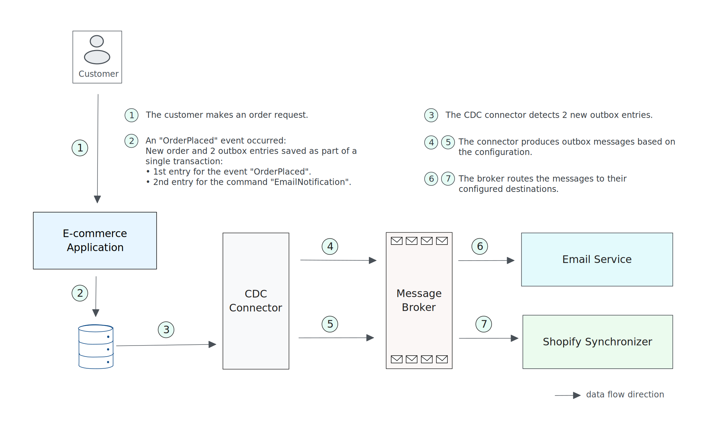

= Spring Outbox

Spring Outbox is an implementation of the transactional outbox pattern that helps Spring developers implement an efficient event-driven architecture with minimal hassle.

== Spring Outbox in action
=== Example of business requirement
Let's consider the following business requirement:

When a customer places an order, the system should:

1. Record the order details and confirm the payment status.
2. Notify the customer via email with an order confirmation.
3. Synchronize the order with Shopify to keep the store updated.

=== Architecture overview
Here’s an overview of the architecture for this requirement:

=== Implementation with Spring Outbox
Following are the steps to implement this design with Spring Outbox:

. **Add dependencies** +
Include the following dependency in your E-commerce Spring Boot application along with necessary Spring starters such as `spring-boot-starter-data-jpa` and `spring-boot-starter-web`:
+
[source, xml]
----

<dependencies>
    <dependency>
        <groupId>io.github.raedbh</groupId>
        <artifactId>spring-outbox-jpa</artifactId>
        <version>0.1.0</version>
    </dependency>
</dependencies>
----

 . **Enable Spring Outbox for JPA ** +
Annotate the main application class with `@EnableJpaRepositories`, specifying `OutboxJpaRepositoryFactoryBean` as the `repositoryFactoryBeanClass`:
+
[source, java]
----
@SpringBootApplication
@EnableJpaRepositories(repositoryFactoryBeanClass = OutboxJpaRepositoryFactoryBean.class)
public class EcommerceApplication {

    public static void main(String[] args) {
        SpringApplication.run(EcommerceApplication.class, args);
    }
}
----
. **Create the order `RootEntity`** +
+
[source, java]
----
@Entity
@Table(name = "orders")
public class Order extends RootEntity {

    private @Id UUID id;
    private BigDecimal totalAmount;
    // Other fields

    @Override
    public UUID getId() {
        return id;
    }

    // Other getters / setters
}
----

. **Define the event** +
Create the `OrderPlaced` event class extending `EventOutboxed`:
+
[source, java]
----
class OrderPlaced extends EventOutboxed<Order> {

    protected OrderPlaced(Order source, CommandOutboxed cmd) {
        super(source, cmd);
    }

    @Override
    public String getOperation() {
        return "payment";
    }
}
----

. **Define the command** +
Create the `EmailNotification` command class implementing `CommandOutboxed`:
+
[source, java]
----
public class EmailNotification implements CommandOutboxed {

    private String to;
    private String subject;
    private String body;
    // ...
}
----

. **Implement the business logic** +
Add a `markPaid` method to the `Order` entity:
+
[source, java]
----
@Entity
@Table(name = "orders")
public class Order extends RootEntity {

    private @Id UUID id;
    private BigDecimal totalAmount;
    // Other fields

    Order markPaid(EmailNotification withNotification) {

        // Business logic here

        // Assign the event, which will be triggered later
        assignEvent(new OrderPlaced(this, withNotification));

        return this;
    }

    @Override
    public UUID getId() {
        return id;
    }

    // Other getters / setters
}

----

. **Add the Application Service** +
Implement the `OrderManagement` service for managing orders:
+
[source, java]
----
@Service
public class OrderManagement {

    private final OrderRepository repository;

    OrderManagement(OrderRepository repository){
        this.repository = repository;
    }

    @Transactional
    Order placeOrder(Order order, EmailNotification emailNotification) {

        order.markPaid(emailNotification);

        return repository.save(order);
    }
}
----
When the `placeOrder` method is called, Spring Outbox triggers the assigned event, producing new entries (for event and command) in the outbox table.

. **Configure and run Debezium connector** :the debezium connector detects new entries in outbox table and transmits them to message broker, RabbitMQ in our example.
// java -jar here

. **Both of ShopifySn.....**

// TODO explain conversion

== Documentation
// TODO

== Contribution
// TODO

== License
Spring Outbox is licensed under https://www.apache.org/licenses/LICENSE-2.0[Apache 2.0 license].
