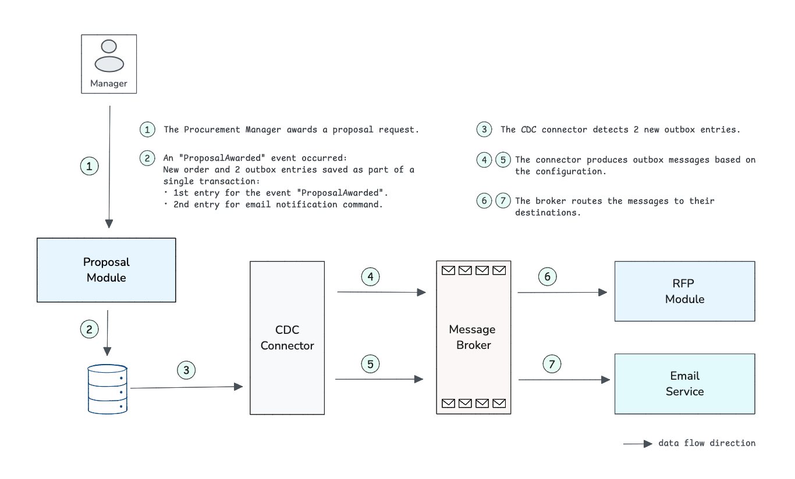

= Spring Outbox Sample

This sample demonstrates a **Source-to-Pay (S2P) system** using Spring Outbox.
The application showcases event-driven communication where domain events are reliably published and consumed between components using the transactional outbox pattern.

== Sample Overview

The S2P system implements a simple procurement workflow:

* **RFP Management**: Create and publish Request for Proposals with requirements
* **Vendor Proposals**: Vendors submit proposals with pricing and other details  
* **Review Process**: Proposals go through a structured review workflow
* **Award Process**: When a proposal is awarded, related messages are produced
* **Downstream Processing**: Downstream processes respond to messages

=== Service Components

* **s2p-app**: The main Source-to-Pay application handling RFPs, proposals, and vendors
* **email-service**: 
  ** **email-service-app**: Dedicated email notification service  
  ** **email-message-contracts**: Shared email message contracts between services

== Architecture Overview

NOTE: The Proposal Module and RFP Module shown in the diagram are both part of the same S2P Application.

The following are the steps to build and run the sample:

== 1. Build the Project

From the root of `spring-outbox`:

[source,bash]
----
./mvnw clean verify -DskipTests
----
This builds all modules, including the sample application.

== 2. Start dependent services

[source,bash]
----
cd spring-outbox-sample
docker compose up -d
----
This command starts the required services: MySQL, RabbitMQ, and the Spring Outbox Debezium Connector.

== 3. Run the Applications

=== Start the S2P Application
[source,bash]
----
java -jar s2p-app/target/s2p-app-*.jar
----
This starts the S2P application on port `8080`.

=== Start the Email Service
In a new terminal:
[source,bash]
----
java -jar email-service/email-service-app/target/email-service-app-*.jar
----
This starts the email service on port `8081`.

== 4. Run Scenario
In a new terminal:
[source,bash]
----
./scenario.sh
----

Here is an example of the output:

[source,text]
----
# Step 1: Create an RFP
RFP created with ID 0b4b1cc4-2e23-418b-8dfd-c3ff8148ab58
--------------------------------------------------------------------------------
# Step 2: Publish the RFP
--------------------------------------------------------------------------------
# Step 3: Creation & submission of 3 proposals from different vendors
--------------------------------------------------------------------------------
# Step 4: Mark the 3 proposals as reviewed
--------------------------------------------------------------------------------
# Step 5: Award 3rd Proposal
--------------------------------------------------------------------------------

Related endpoints:
GET http://localhost:8080/rfps/0b4b1cc4-2e23-418b-8dfd-c3ff8148ab58
GET http://localhost:8080/proposals/search?rfpId=0b4b1cc4-2e23-418b-8dfd-c3ff8148ab58
----

=== Expected Service Logs

When a proposal is awarded (Step 5), you should see logs in both services:

**S2P Application logs:**
[source,text]
----
INFO  --- RfpEventHandlers$ProposalAwardHandler : Received proposal awarded event for RFP: 0b4b1cc4-2e23-418b-8dfd-c3ff8148ab58 from Proposal: 7f8a9b2c-1d4e-4567-8910-abcdef123456
INFO  --- RfpEventHandlers$ProposalAwardHandler : Closed RFP: 0b4b1cc4-2e23-418b-8dfd-c3ff8148ab58
----

**Email Service logs:**
[source,text]
----
INFO  --- EmailNotificationHandler : Received email notification for type: PROPOSAL_AWARDED to: [Contact{email='vendor@example.com', name='Vendor Name'}]
----

== Exploring the Application

=== Key REST Endpoints

==== RFP Management
* `GET /requirements` - List requirement labels (Technical Skills, Experience, etc.)
* `POST /rfps` - Create a new RFP
* `GET /rfps/{id}` - Get RFP details
* `POST /rfps/{id}/publish` - Publish an RFP

==== Proposal Management  
* `POST /proposals` - Submit a new proposal
* `GET /proposals/{id}` - Get proposal details
* `GET /proposals/search?rfpId={id}` - Find proposals for an RFP
* `POST /proposals/{id}/submit` - Submit a proposal
* `POST /proposals/{id}/start-review` - Start reviewing a proposal
* `POST /proposals/{id}/award` - Award a proposal

==== Vendor Management
* `GET /vendors` - List all vendors

=== Database Structure

The S2P application uses MySQL with the following key tables:

* **`rfps`** - Request for Proposals
* **`proposals`** - Vendor proposals  
* **`vendors`** - Vendor information
* **`requirement_labels`** - Types of requirements
* **`outbox`** - Spring Outbox events table (auto-created)

=== Observing Spring Outbox in Action

When a proposal is awarded, you can observe Spring Outbox in action:

1. **Database**: Check the `outbox` table for new entries:
+
[source,sql]
----
SELECT * FROM outbox ORDER BY created_at DESC;
----

2. **Debezium Logs**: Monitor the connector logs for event processing:
+
[source,bash]
----
docker logs spring-outbox-debezium-connector-mysql-rabbit
----

3. **RabbitMQ Management**: Visit http://localhost:15672 (rabbit/secret) to see messages:
   * `s2p.topic` exchange with `proposal.awarded` routing key for ProposalAwarded events
   * `emails` queue for EmailNotification commands

